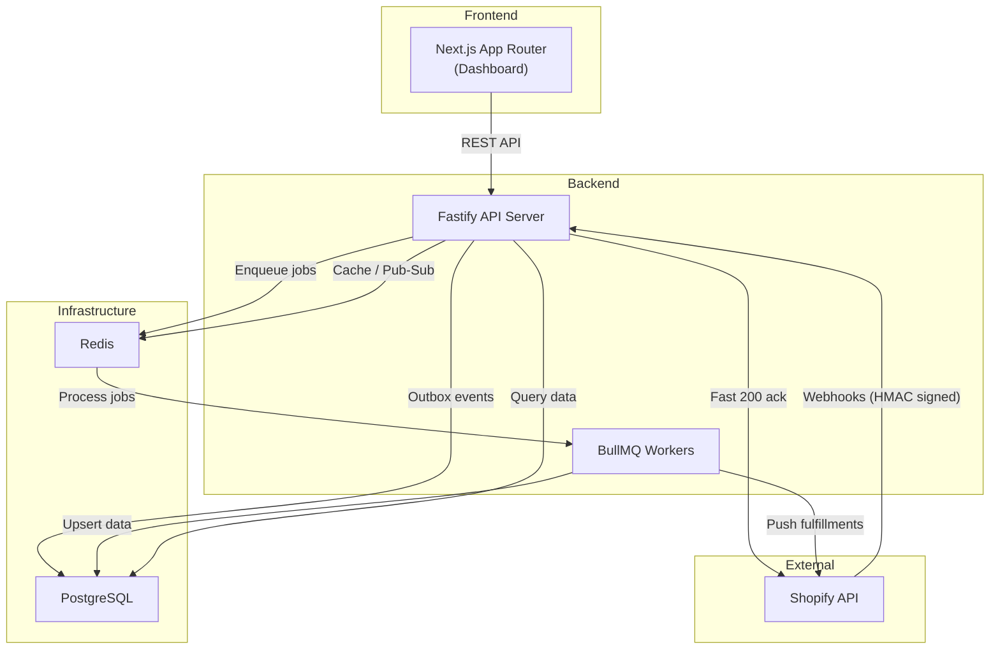

# MerchantFlow

Cross-border e-commerce operations platform for managing orders, shipments, and inventory across Shopify stores. Built with **Fastify**, **Prisma**, **PostgreSQL**, **BullMQ**, and **Next.js**.

## Architecture



### Data Flow

```
Shopify Webhook → HMAC Verify → Deduplicate → Acknowledge (200) → BullMQ Job
                                                                       ↓
                                                                  Process Order
                                                                       ↓
                                                              Prisma Transaction
                                                              ├── Upsert Order
                                                              └── Write Outbox Event
                                                                       ↓
                                                                Outbox Poller
                                                                       ↓
                                                              Deliver Webhooks
                                                              (to merchant endpoints)
```

## Key Technical Decisions

| Decision | Rationale |
|----------|-----------|
| **Transactional Outbox** over direct queue dispatch | If DB transaction succeeds but Redis is down, the event would be lost. Outbox writes in the same transaction, poller publishes asynchronously. |
| **Modular Monolith** over microservices | Clean domain boundaries without distributed system overhead. Worker runs as separate process for independent scaling. |
| **Idempotency Keys** on all mutations | Clients can safely retry failed requests. Response caching ensures identical results. Lock mechanism prevents race conditions. |
| **HMAC Webhook Verification** | Timing-safe comparison prevents signature forgery. Per-store secrets prevent cross-tenant attacks. |
| **BullMQ** over cron/Agenda | Redis-backed durability, built-in retry with exponential backoff, rate limiting per queue, job deduplication. |
| **Cursor Pagination** over offset | O(1) performance at any depth. Stable under concurrent inserts. |
| **Full Jitter** on retries | AWS-recommended pattern. Prevents thundering herd after outages by spreading retries uniformly. |

## Tech Stack

| Layer | Technology |
|-------|-----------|
| Backend | Fastify 5, TypeScript, ESM |
| ORM | Prisma 6, PostgreSQL 16 |
| Queue | BullMQ 5, Redis 7 |
| Frontend | Next.js 15, React 19, Tailwind CSS 4 |
| Validation | Zod (shared between frontend and backend) |
| Testing | Vitest, real DB + Redis (no mocks) |
| Monorepo | Turborepo, pnpm workspaces |
| CI | GitHub Actions |

## Quick Start

```bash
# Prerequisites: Node.js 22+, pnpm, Docker

# 1. Clone and install
git clone https://github.com/yourusername/merchantflow.git
cd merchantflow
pnpm install

# 2. Start infrastructure
docker compose up -d

# 3. Set up environment
cp .env.example apps/api/.env

# 4. Initialize database
pnpm db:generate
pnpm db:migrate
pnpm db:seed

# 5. Start development
pnpm dev
```

- **API**: http://localhost:3001
- **Dashboard**: http://localhost:3000
- **Health Check**: http://localhost:3001/health

## Project Structure

```
merchantflow/
├── apps/
│   ├── api/                  # Fastify backend
│   │   ├── src/
│   │   │   ├── config/       # Env validation, DB, Redis setup
│   │   │   ├── lib/          # Framework-agnostic utilities
│   │   │   │   ├── errors/   # AppError hierarchy + error codes
│   │   │   │   ├── retry/    # Exponential backoff + full jitter
│   │   │   │   ├── idempotency/  # Idempotency key middleware
│   │   │   │   ├── outbox/   # Transactional outbox pattern
│   │   │   │   └── hmac/     # HMAC sign/verify
│   │   │   ├── modules/      # Domain services (vertical slices)
│   │   │   │   ├── order/    # Order sync, list, detail
│   │   │   │   ├── shipment/ # Shipment state machine
│   │   │   │   ├── store/    # Store lifecycle
│   │   │   │   └── webhook/  # Inbound + outbound webhooks
│   │   │   ├── workers/      # BullMQ job processors
│   │   │   ├── routes/       # Fastify route handlers
│   │   │   └── middleware/   # Auth, error handling
│   │   └── prisma/           # Schema, migrations, seed
│   └── web/                  # Next.js dashboard
│       └── src/
│           ├── app/          # App Router pages
│           ├── components/   # UI components
│           ├── hooks/        # TanStack Query hooks
│           └── lib/          # API client, utilities
├── packages/
│   ├── shared-types/         # TypeScript types
│   └── shared-schemas/       # Zod validation schemas
└── docker-compose.yml        # PostgreSQL + Redis
```

## API Endpoints

### Public
| Method | Path | Purpose |
|--------|------|---------|
| `GET` | `/health` | Liveness check |
| `GET` | `/health/ready` | Readiness (DB + Redis) |
| `POST` | `/webhooks/shopify` | Receive Shopify webhooks |

### Authenticated (Bearer API Key + Idempotency-Key on writes)
| Method | Path | Purpose |
|--------|------|---------|
| `GET` | `/api/v1/orders` | List orders (cursor paginated) |
| `GET` | `/api/v1/orders/:id` | Order detail + line items |
| `POST` | `/api/v1/orders/:id/shipments` | Create shipment (202 Accepted) |
| `GET` | `/api/v1/shipments/:id` | Shipment detail |
| `POST` | `/api/v1/shipments/:id/ship` | Mark as shipped |
| `POST` | `/api/v1/webhooks` | Register webhook endpoint |
| `GET` | `/api/v1/webhooks` | List webhook endpoints |

## Reliability Test Suite

Tests target the patterns that break in production, not CRUD operations:

| Test | Pattern Verified |
|------|-----------------|
| Webhook with invalid HMAC is rejected | Security |
| Duplicate webhook ID is idempotently ignored | Deduplication |
| Order upsert doesn't create duplicates on retry | Idempotency |
| Same idempotency key + different body returns 409 | Misuse detection |
| Concurrent idempotency keys return 409 (locked) | Race condition prevention |
| Failed job retries with exponential backoff | Resilience |
| Outbox events are published after transaction commit | At-least-once delivery |
| Multi-store webhook routes to correct store | Tenant isolation |

```bash
pnpm test              # Run all tests
pnpm test -- --watch   # Watch mode
```

## What I'd Add in Production

This is a portfolio demonstration. In a production system, I would add:

- **Real Shopify OAuth** — Full OAuth 2.0 flow with token refresh. Currently mocked.
- **Secrets Management** — AWS Secrets Manager or Vault for encryption keys and API tokens.
- **Observability** — OpenTelemetry traces, Datadog/Sentry for error tracking, Grafana dashboards.
- **Rate Limiting** — Respect Shopify's `X-Shopify-Shop-Api-Call-Limit` header with circuit breaker.
- **Horizontal Scaling** — Separate worker processes, connection pooling (PgBouncer), Redis Cluster.
- **Database** — Read replicas for dashboard queries, partitioning on large tables by store_id.
- **Security** — OWASP headers, CSP, request signing, audit logging.

---

Built by [Jerome](https://github.com/yourusername) as a portfolio demonstration of production-grade e-commerce backend architecture.
